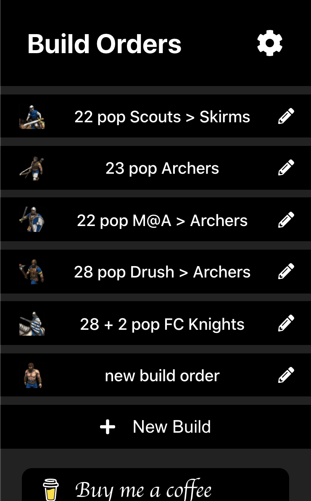
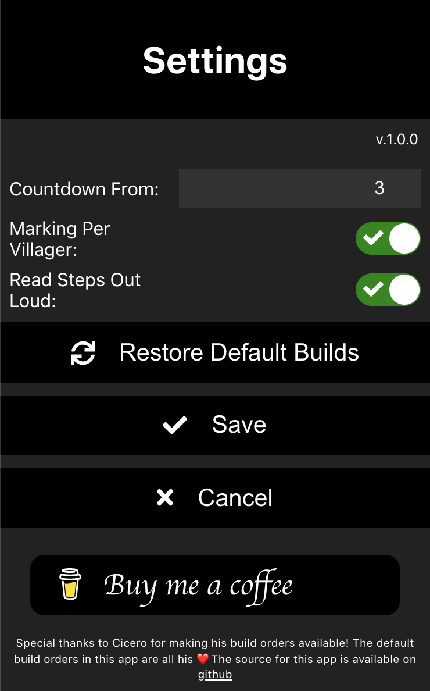

# AoE2 Profile: Builds

This app allows you to create, manage and follow AoE2 build orders on your phone.
It has currently only been tested on chrome for android and is not meant to be used in a desktop environment.

To see it in action, visit https://builds.aoe2-profile.com

Many thanks to Cicero for publishing his build orders online, some of these build orders are included by default in this app. I hope to add more build orders as time progresses...

Many thanks to Microsoft to allow creators like me to use their assets. Age of Empires II: HD© and Age of Empires II: Definitive Edition© Microsoft Corporation. AoE2-profile was created under Microsoft's ["Game Content Usage Rules"](https://www.xbox.com/en-US/developers/rules) using assets from Age of Empires II: Definitive Edition, and it is not endorsed by or affiliated with Microsoft.

## List of Builds
Find the list of builds at https://builds.aoe2-profile.com. A default set of builds is available, but you can modify these builds and create your own.



Click the 'New Build' button to create a new build. This creates an empty build order for you. From here, you can either add new steps or upload a build order that you exported earlier.


When uploading from file, the existing build order is replaced completely with the build order in the file.


## Viewing a Build Order
The build order panel allows you to view and 'play' a build order. The top of the screen shows the villager allocations required in the build order. The bottom area of the screen holds the controls for the build order, these work like the controls of a media player.


## Playing a Build Order
By hitting the 'play' button, the build order will start playing automatically. The clock on top will show the game time and villager allocations will update to reflect what is required by the build at each moment in time.


Notice how the fast-forward and backward controls change while playing. They now allow you to go forward or backward 5 seconds of game time. Hold them to quickly scroll through the build.

The red line shows the current position in the build order. When the line reaches the bottom of a step, that step is supposed to be completed. The duration of each step is computed based on the town-center working time it requires, so some steps will have a duration of 0. If multiple villagers are created during a step, small pips are shown on the left side of the step to indicate where a villager should complete.

When starting a build order, a countdown is shown to allow you to unpause your game at the right time. This countdown is configurable in the settings page.

## Semi automatically playing a Build Order
When first learning a build order, playing it on full auto may be a bit too fast. It is perfectly possible to leave the build order on paused and using the skip forward and backward buttons in that case. You will still get audio cues about the next step to take, and you can progress at your own rate.

## Audio Cues
The build order provides you with audio cues for each step. These cues are automatically generated based on the build order. You can disable audio cues in settings. 

## Build Order Options
A build order has a number of options available from the menu at the top right.


- The `show list` option takes you back to the buid order list.
- The `restart` option sets the game time back to 0.
- The `edit` option allows you to edit the build order.
- The `duplicate` option creates a new build order as a copy of this one.
- The `download` option downloads the build order as a file.
- The `remove` option removes the build order. WARNING: there is no confirmation dialog and this cannot be undone!
## Editing or Creating a Build Order
When editing a build order, you can change the name of the build order and change its steps.


Every step in the build order can be edited. To do this, click a step in the build order.


After clicking the step, an edit interface opens below the step. The first row shows a select interface with the kind of step. The kinds of steps are:
- **Create Villager:** simply create a new villager and assign it to a resource
- **Build:** create a building, optionally create a new villager and assign it to a resource.
- **Get Loom:** get loom...
- **Move:** reassign a number of villagers from a resource to a new resource
- **Research:** research technologies
- **Wheelbarrow:** research wheelbarrow
- **Feudal Age:** research feudal age
- **Castle Age:** research castle age

During each step, a number of options are available. Not all steps will have all options.
- **During Previous:** this step is to be executed during the previous step
- **From:** where the villager to perform the step comes from. For build steps, setting from to a villager means 'create a new villager for this step'.
- **Number:** the number of villagers to assign to/create in this task
- **Target:** the resource to assign villagers to
- **TargeText:** text to show at the bottom of the target resource (e.g. 2 when luring the second boar)
- **Build:** the building/unit to build
- **BuildAmount:** the number of buildings/units to build
- **Techs:** the techs to research

At the bottom of the step are the buttons to stop editing or to remove the step.

Remember to click the checkmark on top of the build order to save it.

## Settings
The settings are available from the menu on the top right of the build order list. The following settings are available in the build order tool:



- **Countdown from:** from how much to count down before starting a build order
- **Markings per villager:** whether to show a pip per villager if there are multiple in a step
- **Read steps out loud:** whether to read steps out loud 

## Export format
The export format is simply json with the following properties:

```
{
  "name": string,
  "icon": string,
  "steps": [
    {
      "kind": "build"|"create"|"age2"|"age3"|"loom"|"move"|"wheelbarrow"|"research",
      "build": string,
      "buildAmount": number,
      "from": string,
      "number": number,
      "target": string,
      "targetText": string,
      "techs": string[]
    }
  ]
}
```

All other properties in the json are computed and are subject to change.

the values for `build`, `from`, `target`, `icon` and `techs` are names of icons. It is best to create and export a build order to find the right names.

Some icons count as resources and will be taken into account for resource computation:
- **villager:** `villager` or `villagerf`
- **food:** `food` or `sheep` or `berries` or `boar`
- **wood:** `wood` or `tree`
- **gold:** `gold`
- **stone:** `stone`

## Offline Capabilities
Once the application is installed on the home screen, it can run in offline mode. However, that means that it will only show updated versions of the app once the application has been closed completely and restarted.
All of your builds are stored on your device itself (very small files, don't worry). If you want to share your builds, you can export them and share the exported files.

If you want to make sure your app has been updated, go to settings and check whether the version number increased.